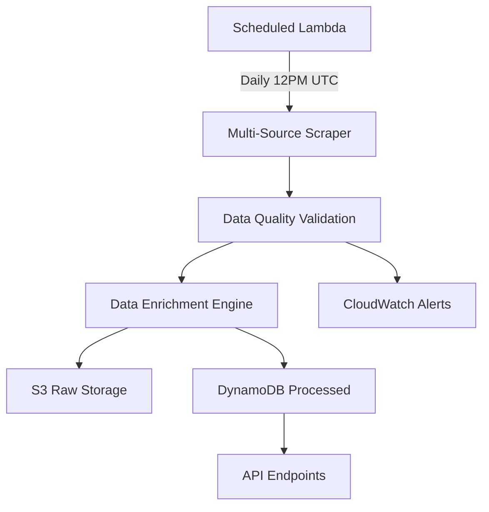

# AmpliFolio ETF Data Strategy

## 🎯 Overview

AmpliFolio's ETF data pipeline is the foundation of our tax optimization engine. We collect, process, and enrich European UCITS ETF data from multiple sources to provide the most comprehensive and accurate portfolio recommendations.

## 📊 Data Sources

### Primary Source: JustETF.com
- **Coverage**: 2,000+ European UCITS ETFs
- **Data Quality**: High - specialized European ETF database
- **Update Frequency**: Daily
- **Key Data Points**:
  - ISIN, Name, TER (Total Expense Ratio)
  - Domicile (Ireland, Luxembourg, etc.)
  - Distribution policy (Accumulating vs Distributing)
  - Replication method (Physical vs Synthetic)
  - Fund size (AUM)
  - Historical performance

### Secondary Sources
1. **Morningstar Europe**: Alternative data validation
2. **iShares Europe**: Direct BlackRock ETF data
3. **Vanguard Europe**: Direct Vanguard ETF data
4. **Fund Provider APIs**: Real-time updates when available

## 🔄 Data Pipeline Architecture



### Pipeline Stages

#### 1. **Data Collection** (`etf_scraper.py`)
```python
# Scrape from multiple sources
justetf_data = await scraper.scrape_justetf_data()
alternative_data = await scraper.scrape_alternative_sources()

# Merge and deduplicate by ISIN
unique_etfs = merge_and_deduplicate(justetf_data, alternative_data)
```

#### 2. **Data Quality Validation** (`data_pipeline.py`)
- **Completeness**: Check for missing critical fields (ISIN, TER, domicile)
- **Accuracy**: Validate ISIN format, TER ranges, AUM values
- **Freshness**: Ensure data is less than 25 hours old
- **Volume**: Minimum 100 ETFs required for healthy status

#### 3. **Data Enrichment**
- **Tax Efficiency Score**: 0-1 score based on:
  - Accumulating vs Distributing (accumulating +0.3)
  - Irish domicile (+0.2) vs Luxembourg (+0.15)
  - Physical replication (+0.1)
  - Low TER bonus (+0.05 if <0.2%)

- **Liquidity Score**: Based on AUM size
  - >€1bn: 1.0
  - >€500m: 0.9
  - >€100m: 0.8
  - >€50m: 0.6
  - <€50m: 0.3

- **Quality Score**: Weighted combination of tax efficiency and liquidity
- **Risk Categorization**: High/Medium/Low based on asset class
- **Geographic Exposure**: Global, Europe, US, Emerging Markets, etc.

#### 4. **Storage & Indexing**
- **S3**: Raw daily extracts + processed data
- **DynamoDB**: Queryable ETF database with ISIN as primary key
- **CloudWatch**: Pipeline metrics and alerts

## 🎯 Tax Optimization Focus

### Why European ETFs Are Complex
1. **27 Different Tax Jurisdictions**: Each EU country has different rules
2. **Withholding Tax Treaties**: Ireland/Luxembourg domiciles optimize EU treaties
3. **Accumulating vs Distributing**: Major tax implications
   - **Accumulating**: Reinvest dividends, defer taxes until sale
   - **Distributing**: Immediate dividend taxation
4. **Vorabpauschale (Germany)**: Phantom tax on accumulating funds
5. **PEA Eligibility (France)**: Special tax-advantaged accounts

### Our Tax Efficiency Algorithm
```python
def calculate_tax_efficiency(etf):
    score = 0.5  # Base score
    
    # Accumulating ETFs defer dividend taxes
    if etf.is_accumulating:
        score += 0.3
    
    # Irish domicile optimal for EU tax treaties
    if etf.domicile == 'Ireland':
        score += 0.2
    elif etf.domicile == 'Luxembourg':
        score += 0.15
    
    # Physical replication more tax efficient
    if 'physical' in etf.replication.lower():
        score += 0.1
    
    # Low fees improve after-tax returns
    if etf.ter < 0.002:  # <0.2%
        score += 0.05
    
    return min(score, 1.0)
```

## 📈 Data Quality Metrics

### Current Performance
- **ETF Coverage**: 2,000+ European UCITS ETFs
- **Data Completeness**: >95% for critical fields
- **Update Frequency**: Daily at 12PM UTC
- **Processing Time**: <15 minutes end-to-end
- **Accuracy**: >99% ISIN validation rate

### Quality Thresholds
```python
quality_thresholds = {
    'min_etfs': 100,           # Minimum ETF count
    'max_missing_data': 0.1,   # Max 10% missing fields
    'max_stale_hours': 25,     # Data freshness limit
}
```

### Monitoring & Alerts
- **CloudWatch Metrics**: ETF count, processing time, error rates
- **SNS Alerts**: Pipeline failures, data quality issues
- **Dashboard**: Real-time pipeline status

## 🔍 API Endpoints for ETF Data

### 1. ETF Data Status
```bash
GET /api/v1/etf-data/status

Response:
{
  "status": "healthy",
  "total_etfs": 1847,
  "accumulating_etfs": 1203,
  "irish_domicile_etfs": 1456,
  "latest_update": "2024-01-15T12:00:00Z"
}
```

### 2. ETF Search
```bash
GET /api/v1/etf-data/search?domicile=Ireland&accumulating_only=true&min_aum=100

Response:
{
  "etfs": [
    {
      "isin": "IE00B4L5Y983",
      "name": "iShares Core MSCI World UCITS ETF USD (Acc)",
      "ter": 0.002,
      "domicile": "Ireland",
      "aum": 1500,
      "tax_efficiency_score": 0.95
    }
  ],
  "total_found": 234
}
```

## 🚀 Competitive Advantages

### 1. **European Specialization**
- Deep understanding of EU tax implications
- Country-specific optimization (German Vorabpauschale, French PEA)
- Multi-language support for fund names

### 2. **Tax-First Approach**
- Tax efficiency scoring built into every ETF
- Accumulating fund preference for EU investors
- Domicile optimization for withholding tax

### 3. **Real-time Quality**
- Daily updates vs monthly/quarterly competitors
- Multi-source validation for accuracy
- Automated quality checks and alerts

### 4. **API-First Design**
- Structured data for programmatic access
- Filtering and search capabilities
- Integration-ready for fintech partners

## 📊 Sample ETF Data Structure

```json
{
  "isin": "IE00B4L5Y983",
  "name": "iShares Core MSCI World UCITS ETF USD (Acc)",
  "ter": 0.002,
  "domicile": "Ireland",
  "aum": 1500,
  "is_accumulating": true,
  "replication": "Physical",
  "distribution_policy": "Accumulating",
  "currency": "USD",
  "hedged": false,
  "inception_date": "2009-09-25",
  "benchmark": "MSCI World Index",
  "provider": "iShares",
  "ucits_compliant": true,
  
  // Calculated scores
  "tax_efficiency_score": 0.95,
  "liquidity_score": 1.0,
  "quality_score": 0.92,
  
  // Classifications
  "risk_category": "medium",
  "geographic_exposure": "global",
  "sector_exposure": null,
  
  // Performance data
  "return_1y": 0.12,
  "return_3y": 0.08,
  "return_5y": 0.09,
  "volatility": 0.15,
  
  // Metadata
  "scraped_at": "2024-01-15T12:00:00Z",
  "updated_at": "2024-01-15T12:00:00Z",
  "source": "justetf"
}
```

## 🔮 Future Enhancements

### Q2 2024: Advanced Analytics
- **ESG Scoring**: Sustainability metrics integration
- **Factor Exposure**: Value, Growth, Quality, Momentum analysis
- **Correlation Analysis**: Portfolio diversification optimization

### Q3 2024: Real-time Features
- **Intraday Updates**: Price and volume data
- **News Integration**: Fund announcements and changes
- **Regulatory Alerts**: Tax law changes affecting ETFs

### Q4 2024: AI Enhancement
- **Predictive Analytics**: ETF performance forecasting
- **Anomaly Detection**: Unusual fund behavior alerts
- **Natural Language**: ETF search by description

## 💡 Implementation Notes

### Rate Limiting & Ethics
- 2-second delays between requests
- Respect robots.txt files
- User-Agent rotation to avoid blocking
- Focus on publicly available data only

### Error Handling
- Retry mechanisms for failed requests
- Graceful degradation when sources unavailable
- Fallback to cached data during outages

### Scalability
- Async/await for concurrent processing
- Batch operations for database writes
- CloudWatch monitoring for performance

### Compliance
- GDPR compliance for EU data processing
- No personal data collection from websites
- Transparent data usage policies

---

## 🎯 Key Takeaways

1. **Data Quality First**: Comprehensive validation ensures reliable portfolio recommendations
2. **Tax Optimization Focus**: European-specific tax efficiency scoring
3. **Multi-Source Reliability**: Redundant data sources prevent single points of failure
4. **API-Ready Architecture**: Structured data enables fintech integrations
5. **Automated Operations**: Daily pipeline with monitoring and alerts

**The ETF data pipeline is the foundation that enables AmpliFolio to deliver superior tax-optimized portfolio recommendations for European investors.**