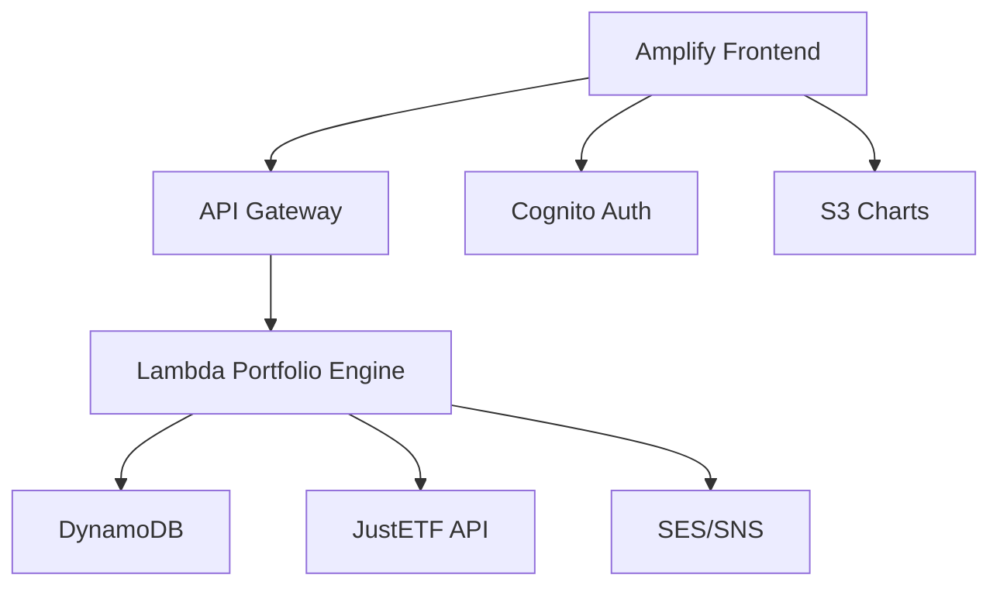
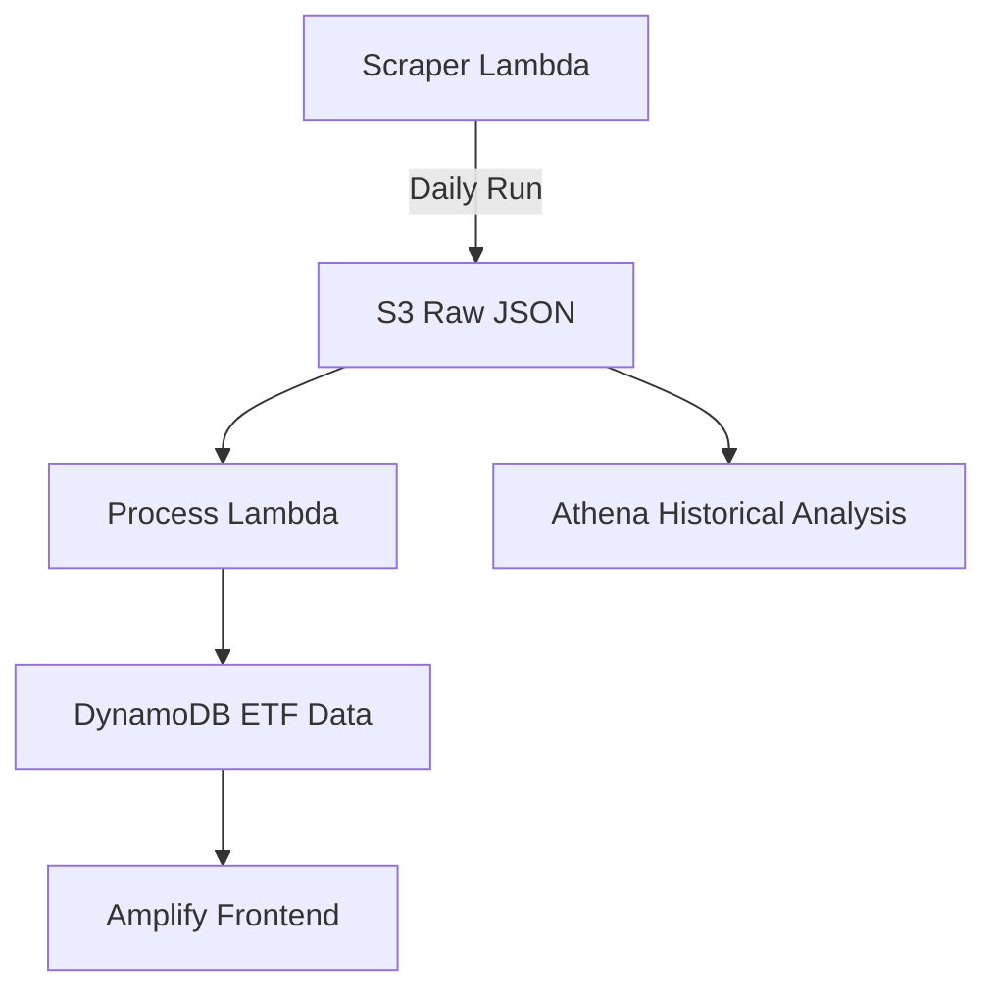

# **Product Requirements Document**  
**Project Name**: AmpliFolio  
**Version**: 1.1 - AWS Amplify Edition  
**Target Launch**: 6-8 weeks (Solo Developer Timeline)

---

## **1. Product Overview**
### **Objective**
Build a serverless web application using AWS Amplify that converts natural language investment requests into optimized ETF portfolios with visualizations.

### **Core AWS Services**


---

## **2. Key Features**

### **A. Amplify Frontend**
- Next.js/Typescript UI
- Natural language input field
- 3 pre-built portfolio templates
- Interactive pie/bar charts (Chart.js)
- Notification preference center

### **B. Backend Services**
1. **Portfolio Engine Lambda (Python)**
   ```python
   def handler(event, context):
       query = event['query']
       risk_profile = analyze_risk(query) # Simple keyword matching
       portfolio = generate_portfolio(risk_profile)
       return { "portfolio": portfolio }
   ```
   
2. **Data Sources**:
   - JustETF Scraped data
   - DynamoDB Tables:
     - `PortfolioCache`: Pre-computed portfolios
     - `UserPreferences`: Notification settings

3. **Auth**:
   - Cognito Social Logins (Google/GitHub)
   - Anonymous guest access

---

## **3. Technical Implementation**

### **Amplify Stack Architecture**
```
amplifolo/
├── frontend/ (Next.js)
│   ├── pages/
│   │   ├── index.tsx (Main UI)
│   │   └── dashboard.tsx 
│   └── components/
│       ├── PortfolioChart.tsx
│       └── NLInput.tsx
│
├── amplify/
│   ├── backend/
│   │   ├── function/
│   │   │   └── portfolioEngine (Python Lambda)
│   │   └── api/
│   │       └── portfolioAPI (GraphQL)
│   └── auth/ (Cognito Config)
│
└── scripts/
    └── etf-cacher.js (Daily DDB updates)
```

### **Key Amplify CLI Commands**
```bash
# Initialize project
amplify init

# Add services
amplify add api # GraphQL for portfolios
amplify add function # Lambda with Python
amplify add auth # Cognito configuration
amplify add storage # DynamoDB tables

# Deploy
amplify push
```

---

Here's the revised PRD section focusing on the JustETF data pipeline with daily S3 extracts and DynamoDB integration using AWS Amplify:

---

# **Data Pipeline Architecture**



---

## **1. Data Collection System**

### **Components**
1. **Modified JustETF Scraper** (Based on [druzsan/justetf-scraping](https://github.com/druzsan/justetf-scraping))
   ```python
   # Lambda-optimized scraper
   def lambda_handler(event, context):
       etf_data = scrape_justetf()
       timestamp = datetime.now().isoformat()
       
       # Save raw to S3
       s3.put_object(
           Bucket='raw-etf-data',
           Key=f'daily/{timestamp}.json',
           Body=json.dumps(etf_data)
           
       return {'status': 200}
   ```

2. **S3 Bucket Structure**
   ```
   s3://etf-data-<account-id>/
   ├── daily/ (Raw daily extracts)
   │   └── 2024-03-15T12:00:00.json
   ├── processed/ (Cleaned data)
   └── archive/ (Monthly snapshots)
   ```

3. **DynamoDB Table Design**
   ```javascript
   {
     "isin": "IE00B4L5Y983", // Partition key
     "updated_at": "2024-03-15T12:00:00Z", // Sort key
     "name": "iShares Core MSCI World UCITS ETF",
     "ter": 0.20,
     "performance_1y": 12.5,
     "holdings": [{"name": "Apple", "weight": 3.2}, ...]
   }
   ```

---

## **2. Implementation Steps**

### **A. Scraper Setup**
1. **Adapt Existing Scraper**
   ```bash
   # Clone and modify scraper
   git clone https://github.com/druzsan/justetf-scraping
   pip install -r requirements.txt -t ./packages
   # Add Lambda handler wrapper
   ```

2. **Deploy with Amplify**
   ```bash
   amplify add function
   ? Select service: Lambda
   ? Function name: etfScraper
   ? Runtime: Python 3.9
   ```

### **B. Scheduled Execution**
1. **EventBridge Rule**
   ```json
   {
     "Schedule": "cron(0 12 * * ? *)" // Daily at 12pm UTC
   }
   ```

2. **IAM Permissions**
   ```yaml
   Policies:
     - S3FullAccess:
         - "arn:aws:s3:::etf-data-*"
     - DynamoDBWriteAccess:
         - "arn:aws:dynamodb:us-east-1:*:table/EtfMetadata"
   ```

---

## **3. Data Processing Flow**

1. **Raw Data Storage**
   - Format: GZIP-compressed JSON
   - Retention: 7 days in S3 Standard → Archive to Glacier

2. **Processing Lambda**
   ```python
   def process_handler(event, context):
       # Get latest S3 file
       latest = s3.list_objects(Bucket='raw-etf-data', Prefix='daily/').sort()[-1]
       
       # Transform data
       cleaned = transform_data(latest)
       
       # Batch write to DynamoDB
       with table.batch_writer() as batch:
           for etf in cleaned:
               batch.put_item(Item=etf)
   ```

3. **Version Control**
   ```bash
   # Maintain 6 months history
   aws s3 lifecycle put-bucket-lifecycle \
     --bucket etf-data-1234 \
     --rules file://lifecycle.json
   ```

---

## **4. Cost Optimization**

| **Service** | **Cost Control** | **Est. Monthly Cost** |
|-------------|------------------|-----------------------|
| S3          | Intelligent Tiering + 90-day Glacier | $0.023/GB |
| DynamoDB    | On-demand + Auto Scaling | $1.25/million WCU |
| Lambda      | 128MB, 5min timeout | 400k invocations free |
| EventBridge | Default event bus | $1/million events |

---

## **5. Security Measures**

1. **Data Protection**
   - S3: AES-256 encryption + Bucket policies
   - DynamoDB: KMS encryption at rest
   - IAM: Least privilege roles

2. **Scraping Compliance**
   - Respect robots.txt
   - 2-second delay between requests
   - User-Agent rotation

---

## **6. Historical Analysis**

**AWS Athena Query Example**
```sql
SELECT isin, AVG(ter) as avg_ter
FROM "etf"."daily_extracts"
WHERE year = '2024'
GROUP BY isin
ORDER BY avg_ter ASC
LIMIT 10;
```

**Data Catalog**  
Using Glue Crawler to auto-discover S3 schema:
```bash
aws glue create-crawler --name etf-crawler \
  --database-name etf \
  --s3-target Path=s3://etf-data-1234/daily/
```

---

## **7. Error Handling**

1. **Retry Mechanisms**
   ```yaml
   # serverless.yml
   functions:
     scraper:
       retryAttempts: 3
       timeout: 900
       events:
         - schedule:
             rate: cron(0 12 * * ? *)
             enabled: true
             input:
               retryCount: 0
   ```

2. **Alerts**
   - CloudWatch Alarms for:
     - Failed Lambda invocations
     - S3 write errors
     - DynamoDB throttling

---

## **4. Development Phases**

| **Phase** | **Weeks** | **Amplify Components** | **Deliverables** |
|-----------|-----------|-------------------------|------------------|
| 1. Setup  | 1-2       | - Frontend scaffolding<br>- Auth config | Basic UI with auth flow |
| 2. Core Engine | 3-4 | - Lambda function<br>- DynamoDB<br>- API Gateway | Functional portfolio generator |
| 3. Visualization | 5-6 | - S3 chart storage<br>- UI components | Interactive charts |
| 4. Notifications | 7-8 | - SES/SNS integration<br>- Lambda triggers | Weekly email alerts |

---

## **5. Cost Optimization Strategy**

| **Service** | **Tactic** | **Cost Projection** |
|-------------|------------|---------------------|
| AWS Amplify | Static hosting (Free tier) | $0/mo |
| Lambda      | 128MB memory, <5s duration | Free tier eligible |
| DynamoDB    | On-demand + RCU/WCU tuning | <$5/mo |
| S3          | Standard storage | <$1/mo |
| SES         | 1k emails/month | $0.10 |

---

## **6. Security Plan**

1. **Authentication**:
   - Cognito with social providers
   - IAM roles for Lambda access
   - API Gateway method auth

2. **Data Protection**:
   - DDB encryption at rest
   - Lambda environment variables
   - HTTPS only

3. **Compliance**:
   - GDPR-ready through Amplify
   - Financial disclaimers in UI

---

## **7. Testing Strategy**

1. **Unit Tests**:
   - Jest for UI components
   - PyTest for Lambda functions

2. **Load Testing**:
   - Artillery.js for API Gateway
   - Simulate 50 concurrent users

3. **User Testing**:
   - 10 beta testers via Amplify Hosting
   - Feedback via in-app form

---

## **8. Launch Plan**

**Pre-Launch**:
- Amplify production branch
- Configure custom domain
- SEO optimizations

**Launch**:
- Product Hunt launch
- /r/aws cross-post
- Twitter thread

**Post-Launch**:
- Amplify Analytics monitoring
- Cost budget alerts
- Feature voting system

---

## **9. Success Metrics**

| **Metric** | **Target** | **Amplify Tool** |
|------------|------------|-------------------|
| MAU        | 500        | Amplify Analytics |
| API Latency | <800ms   | CloudWatch |
| Conversion | 15% signed-up | Cognito |
| Error Rate | <2%       | X-Ray |

---

## **10. Risk Mitigation**

| **Risk** | **Amplify Solution** |
|----------|-----------------------|
| High Lambda costs | Configure billing alerts |
| DDB throttling | Auto-scaling config |
| Authorization issues | Amplify Admin UI |
| Frontend bugs | Amplify CI/CD rollback |

---
