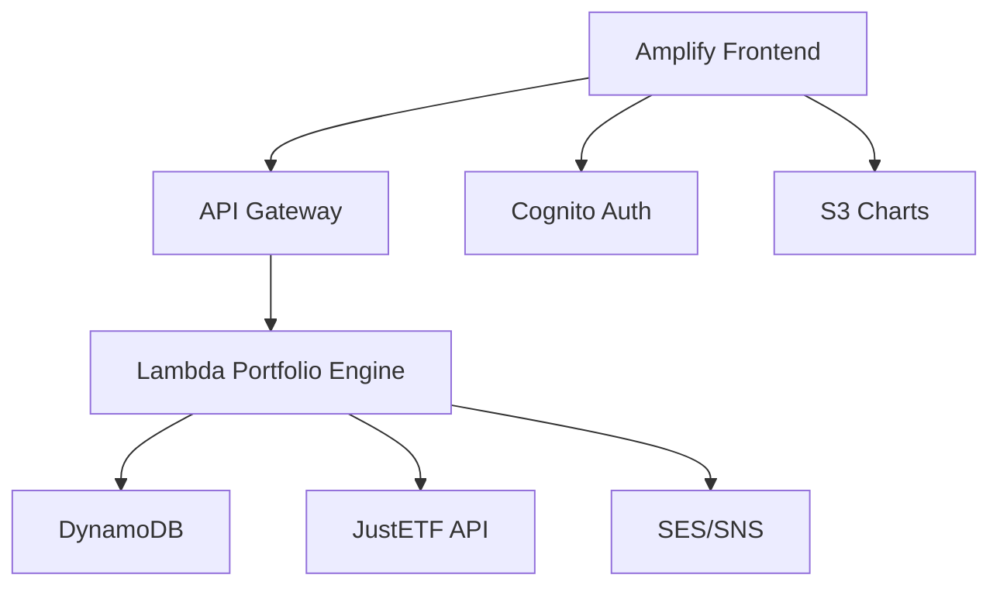
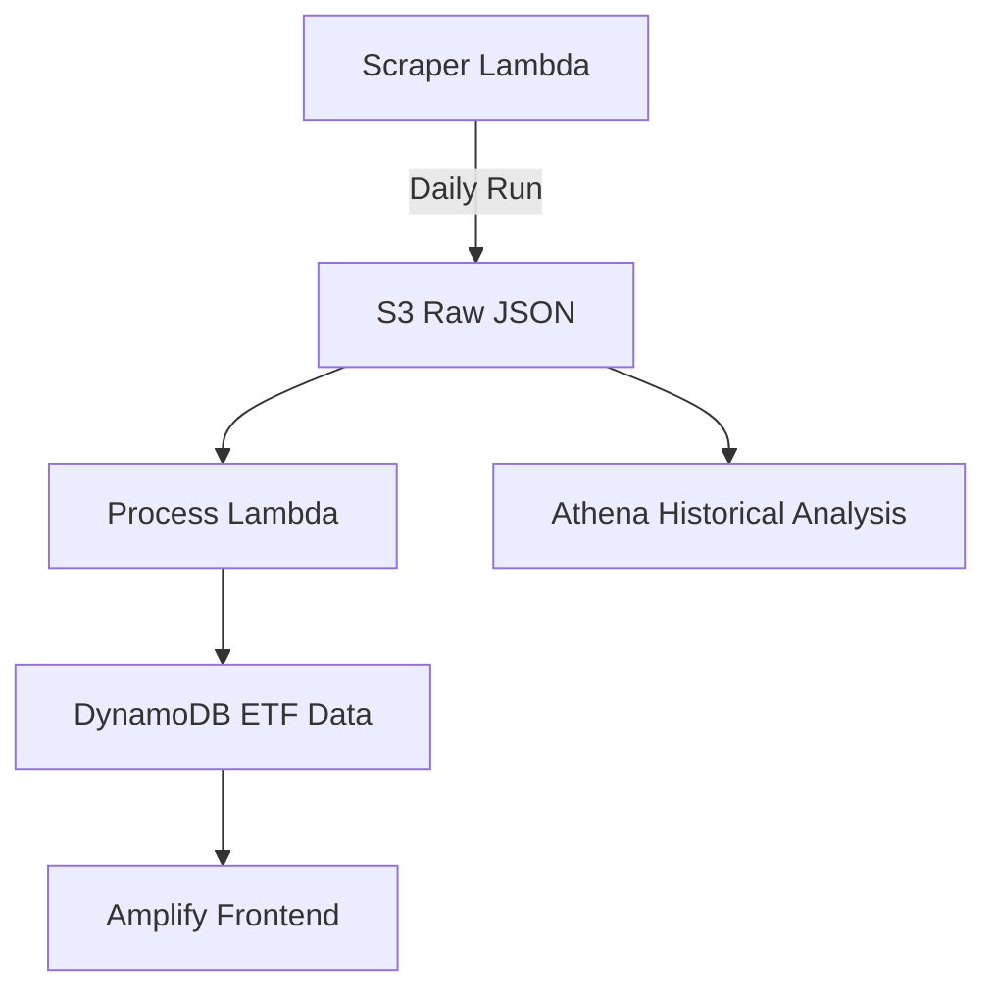

# AmpliFolio Implementation Plan

## Project Overview

AmpliFolio is a serverless web application built using React & NextJS on AWS Amplify that provides a conversational interface powered by Amazon Nova models on Amazon Bedrock and converts natural lanuage interactions on ETF investments into optimized ETF portfolios with visualizations. This implementation plan outlines the technical approach, development phases, and strategies for building the application within a 6-8 week timeline for a solo developer.

## Architecture Overview



### Core Components

1. **Frontend**: Next.js/TypeScript application with natural language input, portfolio templates, and interactive visualizations
2. **Backend**: AWS Lambda functions for portfolio generation and data processing
3. **Data Storage**: DynamoDB for portfolio caching and user preferences
4. **Authentication**: AWS Cognito with social logins
5. **Data Pipeline**: ETF data scraping and processing system

## Implementation Phases

### Phase 1: Project Setup & Authentication (Weeks 1-2)

#### Tasks:
1. **Project Initialization**
   - Set up Next.js/TypeScript project
   - Initialize AWS Amplify
   ```bash
   # Initialize project
   amplify init
   ```

2. **Authentication Setup**
   - Configure Cognito with social providers (Google/GitHub/Facebook)
   - Implement anonymous guest access
   ```bash
   # Add authentication
   amplify add auth
   ```

3. **Frontend Scaffolding**
   - Create basic UI components
   - Set up routing structure
   - Implement auth flow UI

#### Deliverables:
- Basic UI with authentication flow
- Project structure established
- Amplify configuration completed

### Phase 2: Core Portfolio Engine (Weeks 3-4)

#### Tasks:
1. **API Configuration**
   - Set up API Gateway with GraphQL
   ```bash
   # Add API
   amplify add api
   ```

2. **Lambda Function Development**
   - Implement portfolio engine in Python
   ```python
   def handler(event, context):
       query = event['query']
       risk_profile = analyze_risk(query) # Simple keyword matching
       portfolio = generate_portfolio(risk_profile)
       return { "portfolio": portfolio }
   ```

3. **DynamoDB Setup**
   - Create tables for portfolio caching and user preferences
   ```bash
   # Add storage
   amplify add storage
   ```

4. **JustETF Integration**
   - Implement ETF data scraping functionality
   - Set up data processing pipeline

#### Deliverables:
- Functional portfolio generator
- API endpoints for portfolio creation
- Database structure for portfolio storage
- Initial ETF data pipeline

### Phase 3: Data Visualization & UI Enhancement (Weeks 5-6)

#### Tasks:
1. **Chart Implementation**
   - Integrate Chart.js for portfolio visualizations
   - Create pie/bar chart components

2. **S3 Chart Storage**
   - Configure S3 for storing chart data
   - Implement chart generation and storage logic

3. **UI Refinement**
   - Enhance natural language input field
   - Implement 3 pre-built portfolio templates
   - Create dashboard view

#### Deliverables:
- Interactive portfolio visualizations
- Enhanced UI with templates
- Complete user dashboard

### Phase 4: Notifications & Final Integration (Weeks 7-8)

#### Tasks:
1. **Notification System**
   - Set up SES/SNS integration
   - Implement notification preference center
   - Create email templates

2. **Data Pipeline Completion**
   - Finalize ETF data scraping and processing
   - Implement scheduled execution via EventBridge
   - Set up error handling and monitoring

3. **Testing & Optimization**
   - Conduct unit and integration testing
   - Optimize performance
   - Implement security measures

#### Deliverables:
- Weekly email alert system
- Complete data pipeline with monitoring
- Fully tested application

## Technical Stack Details

### Frontend
- **Framework**: Next.js with TypeScript
- **UI Components**: Custom components with responsive design
- **State Management**: React Context API
- **Visualization**: Chart.js for interactive charts
- **Directory Structure**:
  ```
  frontend/
  ├── pages/
  │   ├── index.tsx (Main UI)
  │   └── dashboard.tsx 
  └── components/
      ├── PortfolioChart.tsx
      └── NLInput.tsx
  ```

### Backend
- **Runtime**: AWS Lambda with Python 3.9
- **API**: GraphQL API via API Gateway
- **Database**: DynamoDB with on-demand capacity
- **Authentication**: Cognito with social logins
- **Directory Structure**:
  ```
  amplify/
  ├── backend/
  │   ├── function/
  │   │   └── portfolioEngine (Python Lambda)
  │   └── api/
  │       └── portfolioAPI (GraphQL)
  └── auth/ (Cognito Config)
  ```

## Data Pipeline Implementation

### Architecture


### Components
1. **ETF Scraper Lambda**
   - Based on modified [druzsan/justetf-scraping](https://github.com/druzsan/justetf-scraping)
   - Daily execution via EventBridge
   - Raw data storage in S3

2. **Data Processing Lambda**
   - Transforms raw ETF data
   - Writes to DynamoDB for application use
   - Handles error cases and retries

3. **Storage Structure**
   - S3 bucket for raw and processed data
   - DynamoDB table for application access
   - Athena for historical analysis

### Implementation Steps
1. **Scraper Setup**
   ```bash
   # Clone and modify scraper
   git clone https://github.com/druzsan/justetf-scraping
   pip install -r requirements.txt -t ./packages
   # Add Lambda handler wrapper
   ```

2. **Scheduled Execution**
   - EventBridge rule for daily execution
   - IAM permissions for S3 and DynamoDB access

3. **Data Processing Flow**
   - Raw data storage in GZIP-compressed JSON
   - Processing Lambda for data transformation
   - Batch writing to DynamoDB

## Testing Strategy

### Unit Testing
- Jest for UI components
- PyTest for Lambda functions
- Coverage targets: >80% for core functionality

### Integration Testing
- End-to-end testing of portfolio generation flow
- API Gateway testing with Artillery.js
- Simulate 50 concurrent users

### User Testing
- 10 beta testers via Amplify Hosting
- Feedback collection via in-app form
- Iterative improvements based on feedback

## Deployment Strategy

### Development Environment
- Local development with Amplify mock
- Feature branch deployments

### Staging Environment
- Automated deployments from develop branch
- Integration testing environment

### Production Environment
- Amplify production branch deployment
- Custom domain configuration
- SEO optimizations

### CI/CD Pipeline
- GitHub Actions for automated testing
- Amplify Console for deployment
- Rollback capabilities for production issues

## Security Implementation

### Authentication & Authorization
- Cognito with social providers
- IAM roles for Lambda access
- API Gateway method authentication

### Data Protection
- DynamoDB encryption at rest
- Lambda environment variables for secrets
- HTTPS-only communication

### Compliance
- GDPR-ready through Amplify features
- Financial disclaimers in UI
- Data retention policies

## Cost Management

| Service | Tactic | Cost Projection |
|---------|--------|-----------------|
| AWS Amplify | Static hosting (Free tier) | $0/mo |
| Lambda | 128MB memory, <5s duration | Free tier eligible |
| DynamoDB | On-demand + RCU/WCU tuning | <$5/mo |
| S3 | Standard storage | <$1/mo |
| SES | 1k emails/month | $0.10 |

### Optimization Strategies
- Lambda memory and timeout configuration
- DynamoDB auto-scaling
- S3 lifecycle policies for cost-effective storage
- CloudWatch billing alerts

## Post-Launch Monitoring

### Key Metrics
| Metric | Target | Amplify Tool |
|--------|--------|-------------|
| MAU | 500 | Amplify Analytics |
| API Latency | <800ms | CloudWatch |
| Conversion | 15% signed-up | Cognito |
| Error Rate | <2% | X-Ray |

### Monitoring Tools
- CloudWatch dashboards for operational metrics
- X-Ray for tracing and performance analysis
- Amplify Analytics for user behavior

## Risk Management

| Risk | Mitigation Strategy |
|------|---------------------|
| High Lambda costs | Configure billing alerts and optimize function execution |
| DynamoDB throttling | Implement auto-scaling and monitor capacity |
| Authorization issues | Use Amplify Admin UI for troubleshooting |
| Frontend bugs | Implement Amplify CI/CD with rollback capability |
| Data scraping failures | Set up retry mechanisms and alerts |

## Conclusion

This implementation plan provides a structured approach to building the AmpliFolio application using AWS Amplify services. By following the phased development approach and leveraging the serverless architecture, the application can be built within the 6-8 week timeline while maintaining quality, security, and cost-effectiveness.

The plan emphasizes:
1. Iterative development with clear deliverables
2. Robust data pipeline for ETF information
3. Comprehensive testing strategy
4. Security-first approach
5. Cost-effective infrastructure
6. Post-launch monitoring and optimization

Regular reviews of progress against this plan will help ensure successful delivery of the AmpliFolio application.