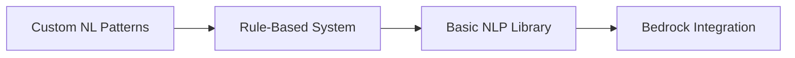

# Wardley Map Strategy for ETF Portfolio Assistant

---

### **1. Value Chain Components**  
*(Ordered from User Need to Fulfillment)*

1. **User Interface** (Natural Language Input)  
2. **Query Processing** (Intent Recognition)  
3. **Portfolio Calculation** (Markowitz Optimization)  
4. **ETF Data Acquisition**  
5. **Visual Presentation** (Charts)  
6. **Notification System**  

---

### **2. Component Mapping**  

| **Component**               | **Evolution Stage** | **Visibility** | **Position**     |  
|------------------------------|---------------------|----------------|-------------------|  
| Natural Language Interface   | Custom-Built        | High           | Upper Left        |  
| Intent Recognition Logic     | Custom-Built        | Medium         | Mid-Left          |  
| Markowitz Optimization       | Product             | High           | Upper Middle      |  
| ETF Market Data              | Commodity           | Low            | Lower Right       |  
| Chart Visualization          | Product             | High           | Upper Right       |  
| Email Notifications          | Commodity           | Low            | Lower Right       |  

---

### **3. Strategic Landscape**  

```plaintext
Visibility (Y-axis)
▲
│                [NL Interface] 
│                [Markowitz]
│                [Charts]
│       [Intent Logic]        
│                                 
│                                           
│                             [ETF Data] [Notifications]
└───────────────────────────────────────────────────────▶ Evolution (X-axis)
   Genesis → Custom → Product → Commodity
```

---

### **4. Key Strategic Decisions**  

**A. Focus Investments**  
1. **Differentiators (Upper Left Quadrant)**  
   - Develop simple natural language pattern matching  
   - Create portfolio templates for 3 risk profiles  

2. **Leverage Existing Solutions (Right Side)**  
   - Use Chart.js for visualization (Product stage)  
   - Rely on JustETF for ETF data (Commodity)  

**B. Cost Optimization**  
- Implement basic Markowitz with PyPortfolioOpt library  
- Use serverless architecture (AWS Free Tier)  

**C. Evolutionary Path**  


---

### **5. Tactical Actions**  

**Phase 1 (Weeks 1-4)**  
1. Build core UI with pre-defined queries  
2. Implement basic Markowitz equal-weight strategy  
3. Set up static ETF data cache  

**Phase 2 (Weeks 5-8)**  
1. Add dynamic chart updates  
2. Implement weekly email cron job  
3. Create 3 portfolio templates  

**Phase 3 (Optional)**  
1. Add keyword-based intent recognition  
2. Enable CSV data exports  

---

### **6. Risk Mitigation**  

| **Risk**                  | **Response**                          |  
|---------------------------|---------------------------------------|  
| Complex portfolio math    | Use PyPortfolioOpt library            |  
| NLU implementation delays | Start with button-based risk selector |  
| AWS costs escalation       | Implement usage monitoring            |  

---

### **7. Key Metrics**  
- Time-to-first-portfolio < 30 seconds  
- 90% successful query parsing rate  
- <$15/month cloud costs  

---
